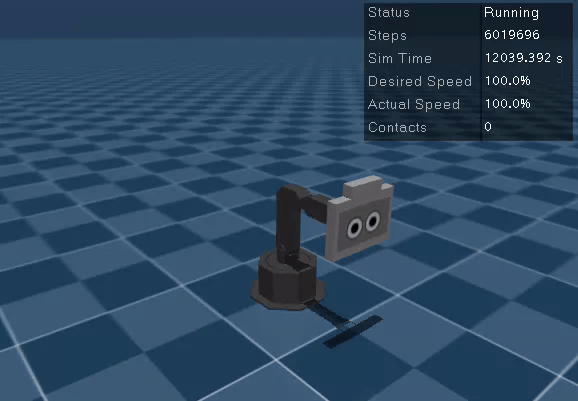

# Setting up your ROS 2 Workspace

## Table of Contents

  * [Part 0 - Install dependencies](#part-0---install-dependencies)
  * [Part I - Set up your workspace to work with Shutter](#part-i---set-up-your-workspace-to-work-with-shutter)
  * [Part II - Test out Shutter's Simulation](#part-ii---test-out-shutters-simulation)

## Part 0 - Install dependencies

You should have access to a computer with `Ubuntu 24.04` and `ROS 2 Jazzy` to complete the assignments in this repository. The instructions below assume that you are using a [bash shell](https://www.gnu.org/software/bash/) to do the assignments.

   > Note that all the apt dependencies that require sudo (admin permissions) below are already installed in the Zoo machines and in the BIM laptops that registered students have access to for the course. Simlarly, `rosdep init` has already been executed. Thus, you can skip the next apt install block and only run the pip commands that follow on those computers.

With ROS2 installed, in a terminal, run the following commands to install general system dependencies for Shutter's code:

```
$ sudo apt update
$ sudo apt install -y $(grep -v '^\s*#' apt-dependencies.txt | tr '\n' ' ')
$ sudo rosdep init          # once per machine; writes /etc/ros/rosdep/
```

## Part I - Set up your workspace to work with Shutter

*Colcon* is the official build system for ROS 2. To understand what it is for and why it exists, 
read sections 1, 2 and 4 of Colcon's conceptual overview document: 
[https://colcon.readthedocs.io/en/released/user/quick-start.html](https://colcon.readthedocs.io/en/released/user/quick-start.html).

Set up your Colcon workspace to work with the Shutter robot:

1. Create a [workspace](https://docs.ros.org/en/jazzy/Tutorials/Beginner-Client-Libraries/Creating-A-Workspace/Creating-A-Workspace.html) called *ros2_ws* 
in your home directory. To do this, follow steps 1-2 in this tutorial: 
[https://docs.ros.org/en/jazzy/Tutorials/Beginner-Client-Libraries/Creating-A-Workspace/Creating-A-Workspace.html](https://docs.ros.org/en/jazzy/Tutorials/Beginner-Client-Libraries/Creating-A-Workspace/Creating-A-Workspace.html)

    > The [tutorial](https://docs.ros.org/en/jazzy/Tutorials/Beginner-Client-Libraries/Creating-A-Workspace/Creating-A-Workspace.html) page is written for different ROS distributions. Follow the tutorial for the distribution of ROS 2 that you have installed in your system, i.e., Jazzy.

    > To make the ROS commands accessible in a terminal, you need to `$ source /opt/ros/jazzy/setup.bash`. You can add this line to the end of the configuration file for your shell (e.g., add it at the end of `~/.bashrc` for a bash shell) so that you do not have to source the `setup.bash` ros file every time you open a new terminal.
    
    > There is no need to install the sample repo in the tutorial in your workspace. If you do, though, you may need to install other dependencies to run your code, which may require sudo. There is no need to do that for this assignment and we cannot provide you sudo in the Zoo machines or BIM laptops.


2. Download Shutter's codebase into your workspace's `src` directory.
    ```bash
    # Go to the src folder in your workspace
    $ cd ~/ros2_ws/src

    # Clone the Shutter packages from GitLab
    $ git clone https://gitlab.com/interactive-machines/shutter/shutter-ros2.git

    # Switch to the 'bim' branch
    $ cd shutter-ros2
    $ git fetch origin
    $ git switch bim
 
    # Load git submodules with ROS dependencies
    $ git submodule update --init --recursive
    ```
    
    > [Git submodules](https://git-scm.com/book/en/v2/Git-Tools-Submodules) are other,
    external projects (Git repositories) that have been included in 
    the shutter-ros2 repository. These projects are needed to run the robot's base code.
    
    You should now have a number of directories in ~/ros2_ws/src/shutter-ros2, including:
    
    ```bash
    $ cd ~/ros2_ws/src
    $ ls -C1 shutter-ros2
    documentation
    shutter_bringup
    shutter_description
    (...)
    ```
    
    Some of these directories are standard folders, other are ROS 2 packages. 
    A ROS 2 package contains:
    
    1. A [package.xml](https://docs.ros.org/en/jazzy/Tutorials/Beginner-Client-Libraries/Creating-Your-First-ROS2-Package.html#write-a-package-xml-file:~:text=package%2Exml,-file) file
    that contains basic information about the package, e.g., package name, description,
    license, author, dependencies, etc.
    
    2. A [CMakeLists.txt](https://docs.ros.org/en/jazzy/Tutorials/Beginner-Client-Libraries/Creating-Your-First-ROS2-Package.html#write-a-package-xml-file:~:text=CMakeLists%2Etxt) file that is 
    used by [colcon](https://docs.ros.org/en/jazzy/Tutorials/Beginner-Client-Libraries/Colcon-Tutorial.html) -- ROS 2's [build tool](https://design.ros2.org/articles/build_tool.html) -- to build the software package.
    
    For example, the shutter_bringup package has the following files:
    
    ```bash
    # Example
    $ ls -C1 ~/ros2_ws/src/shutter-ros2/shutter_bringup
    CMakeLists.txt
    config
    launch
    package.xml
    README.md
    (...)
    ```
    
    > Each ROS 2 package must have its own folder. This means that there cannot be
    nested packages. Multiple packages cannot share the same directory.
    
    Read the README.md file in the root level of the 
    [shutter-ros2](https://gitlab.com/interactive-machines/shutter/shutter-ros2.git) repository
    to understand its content and general organization. You can also access the documentation for shutter-ros at [https://shutter-ros2.readthedocs.io](https://shutter-ros2.readthedocs.io). 

3. Get additional dependencies for Shutter

    ```bash
    cd ~/ros2_ws
    vcs import src --input src/shutter-ros2/jazzy_moveit.repos
    vcs import src --input src/shutter-ros2/jazzy_mujoco.repos
    ```

3. Build the packages in the src directory of your workspace with `colcon build`. 

    ```bash
    # Source the main jazzy setup.bash
    # This gives you access to colcon for building your workspace
    $ source /opt/ros/jazzy/setup.bash

    # Build your workspace
    $ cd ~/ros2_ws
    $ colcon build --symlink-install --packages-skip moveit_ros_tests moveit_runtime --cmake-args -DCMAKE_BUILD_TYPE=Release --parallel-workers 2
    ```

    (again, be patient...)


    Now you should have an install space in `~/ros2_ws/install`, which contains its own `setup.bash` file.
    Sourcing this file will `overlay` the install space onto your environment. Overlaying refers to building and using a ROS 2 package from source on top of an existing version of that same package (e.g., installed at the system level in /opt/ros/jazzy). For more information on overlaying, read [this tutorial](https://docs.ros.org/en/eloquent/Tutorials/Workspace/Creating-A-Workspace.html#:~:text=You%20also%20have,its%20parent%20underlays.).

    > Note that the `colcon build` command generated a `build` directory when it compiled the code in your `src` folder. This `build` directory has intermediary build files needed during the compilation process to generate the executables and libraries in the `install` folder. 
    If you ever need to, you can delete the `build` and `install` folders and re-run `colcon build` within `ros2_ws` to recompile everything from scratch.

    > About `--symlink-install`: by default, `colcon build` *copies* files like Python scripts, launch files, and configuration files from your `src` folder into the `install` folder. That means every time you edit one of those files, you have to re-run `colcon build` before ROS 2 sees your change. With `--symlink-install`, colcon creates a [symbolic link](https://en.wikipedia.org/wiki/Symbolic_link) in `install` that points back at the original file in `src` instead of copying it. Your edits then take effect immediately -- you can change a Python node, save, and re-run it with `ros2 run` without rebuilding. This will save you a lot of time in the assignments.
    >
    > Two caveats. First, because the installed file is just a link to your source file, the *source* file must have executable permissions for `ros2 run` to be able to run it. Whenever you create a new Python node, remember to run `chmod +x <your-script>.py` on it. Second, symlinks only help for files that are used as-is (Python scripts, launch files, configs). Anything that has to be compiled or generated -- C++ code, or the Python bindings for a custom message type -- still requires a `colcon build`. Creating a brand new script also requires one rebuild, so that colcon can create the link for it.
    >
    > Use the same `colcon build` command (with `--symlink-install`) every time you rebuild your workspace. If you build once with the flag and once without it, you will end up with a mix of links and stale copies in your `install` folder, and it will not be obvious which version of your code is actually running. In that case, delete the `install`, `build` and `log` folders within your workspace, and run again `colcon build`.


4. Configure your bash environment. First, add ```source /opt/ros/jazzy/setup.bash``` and ```source ~/ros2_ws/install/setup.bash``` at the end of your `.bashrc` file to automatically set up your environment with your workspace every time you open a new shell. Otherwise, make sure to source ~/ros2_ws/install/setup.bash on every new shell that you want to use to work with ROS 2. Sourcing setup.bash from your install space will ensure that ROS 2 can work properly with the code that you've added to and built in ~/ros2_ws. 

    Second, add ```export ROS_AUTOMATIC_DISCOVERY_RANGE="LOCALHOST"``` at the end of your `.bashrc` file to ensure that ROS 2 only runs on your local network. 

    > By default, ROS 2 will search for nodes on all computers within your network's computer. Thus, it is critical that you setup the auatomatic discovery range to `LOCALHOST`.

    Because it is likely that multiple students in BIM will end up using the same machine for the assignments, we ask you to please set up a `ROS_DOMAIN_ID` that is unique to you in the class. This will minimize the chances that when you are working on the assignment, someone else's node interferes with your work. You should set up this variable in your `~/.bashrc` file: ```export ROS_DOMAIN_ID=X``` where X is the number next to your name in this [list](https://yale.instructure.com/courses/119125/files/folder/Data?preview=13031843).

      

## Part II - Test out Shutter's Simulation

Now that you have setup Shutter's code in your colcon workspace, you will simulate
the Shutter robot and use basic ROS 2 tools to gather information about 
[ROS 2 nodes](https://docs.ros.org/en/jazzy/Tutorials/Beginner-CLI-Tools/Understanding-ROS2-Nodes/Understanding-ROS2-Nodes.html)
-- processes that perform computation in your ROS 2 system -- and 
[ROS 2 messages](https://docs.ros.org/en/jazzy/Tutorials/Beginner-CLI-Tools/Understanding-ROS2-Topics/Understanding-ROS2-Topics.html) -- data being sent from one node to another.
     
1. Open another terminal, source your environment, and *bring up* a simulated version of the Shutter robot 
with [ros2 launch](https://docs.ros.org/en/jazzy/Tutorials/Beginner-CLI-Tools/Launching-Multiple-Nodes/Launching-Multiple-Nodes.html).

    ```bash
    $ source /opt/ros/jazzy/setup.bash     # only necessary if not sourced already through the .bashrc file
    $ source ~/ros2_ws/install/setup.bash  # only necessary if not sourced already through the .bashrc file
    $ ros2 launch shutter_bringup shutter_sim.launch.py face:=true
    ```
    
    > `ros2 launch` is a tool for easily launching and configuring multiple ROS 2 nodes. Instead of starting each node in a separate terminal, a launch file allows you to start them all with a single command, automatically setting their specific configuration parameters. You will often be working with launch files in your assignments.
    
    The [shutter_sim.launch.py](shutter_bringup/launch/shutter_sim.launch.py) file will run another launch file ([shutter_mujoco.launch.py](shutter_mujoco_sim/launch/shutter_mujoco.launch.py)) which will open up a [MuJoCo simulation](https://mujoco.org/) of the robot and set up connections between ROS 2 and MuJoCo. 

    
    
    The [shutter_mujoco.launch.py](shutter_mujoco_sim/launch/shutter_mujoco.launch.py) script in turn runs [simple_face.launch.py](shutter_face_ros/launch/simple_face.launch.py) to begin face rendering for the robot. Also, it runs [shutter_control.launch.py](https://gitlab.com/interactive-machines/shutter/shutter-ros2/-/blob/bim/shutter_hardware_interface/launch/shutter_control.launch.py?ref_type=heads) to bring up the [ros2_control stack](https://control.ros.org/rolling/index.html) on the robot as well as publish a model of the robot and its current state (i.e., the position of its servos).
    
    > When running commands on a terminal, pay attention to the information that is printed in the terminal. If you see any errors, please post them in Ed discussion and/or communicate with the course staff. 

    The description of the robot is in [URDF format](https://docs.ros.org/en/jazzy/Tutorials/Intermediate/URDF/URDF-Main.html). In particular, the URDF model has information about the the joints of the robot and its sensors, including specific properties and relative placement.

    > The robot description is published through the `/robot_description` topic. You can see the information being sent through this topic using the `ros2 topic echo --once /robot_description` in a terminal.

    > About ROS 2 Parameters: In ROS 1, the robot model used to be stored in a system-level parameter in ROS. But, unlike ROS 1, ROS 2 does not have a central parameter server. Instead, each node maintains its own set of parameters. These parameters are used to configure the node at runtime without needing to recompile code. While parameters are managed by individual nodes, they are still accessible across the entire ROS 2 system. You can use command-line tools (like `ros2 param list` and `ros2 param get <node_name> <param_name>`) to inspect and change a node’s parameters. Launch files are the most common way to set initial parameter values when a system starts up. This parameter system is best used for static, non-binary data such as configuration settings.

    The information about the robot state is sent to [tf2](https://docs.ros.org/en/jazzy/Tutorials/Intermediate/Tf2/Tf2-Main.html), which stores and helps reason about all the coordinate systems in the ROS network. 

2. Visualize the robot model and its coordinate frames in [RViz2](https://docs.ros.org/en/jazzy/Tutorials/Intermediate/RViz/RViz-Main.html)--the main visualization interface in ROS. In a new terminal, where you have sourced your workspace `setup.bash`, run:

    ```bash
    ros2 run rviz2 rviz2 -d ~/ros2_ws/src/f26-assignments/assignment-1/shutter_lookat/config/shutter-model.rviz --ros-args -p use_sim_time:=true
    ```

    

    The argument `-d <config.rviz>` provides RViz a configuration file that sets its windows and plugins in a specific way, such that it looks as in the above image when it opens. The `--ros-args` argument indicates that what follows are arguments for RViz in relation to ROS, and `-p` corresponds to `--param`, i.e., so what follows is a parameter related to ROS. Then, `--ros-args -p use_sim_time:=true` is a shortcut for making RViz use simulated time while it runs (as output by the MuJoCo simulation) instead of your machine's current time.

    RViz can be used to visualize many things in the ROS system, including the state of the robot (e.g., as published via the `/robot_description` topic),
    its coordinate frames (published via `/tf` and `/tf_static`), images (like an image of its face, as published via `/face/image`), etc.

    Each coordinate frame in the robot associated with a [link](https://wiki.ros.org/urdf/XML/link). For example: 

    1. `shutter_base_link`, which is at the very bottom of the robot with the $x$ axis (red) pointing forward; 
    2. `shutter_shoulder_link`, which is above `shutter_base_link` and allows the robot to rotate left and right (yaw angle); 
    3. `shutter_biceps_link`, which is above `shutter_shoulder_link` and allows the robot's head to move forward and backward;
    4. `shutter_forearm_link`, which allows the head to move up and down; and
    5. `shutter_wrist_link`, which allows the head to tilt.

    The above 5 links make up a significant portion the kinematic chain of the robot.

    > Note that the robot has many more frames than the 5 links mentioned above. Some of these additional frames
    do not correspond to real robot links (specific rigid bodies) but were added to the robot's model (its URDF description)
    for convenience. For example, there are coordinate frames (like `shutter_left_eye`) for helping control the eye's of the robot when rendered in 
    its screen.


3. Try commanding the robot from the command line. First, let's see what control options are available. In a new terminal, after sourcing your workspace `setup.bash`, run:

    ```bash
    $ ros2 control list_controllers
    ```
    You should then see a list with three elements:
    - `joint_group_controller`: position controller that takes as input the position in radians for each of the 4 joints in the robot. The controller claims the joint's position command interface (**inactive**).
    - `follow_trajectory_controller`: trajectory controller that takes as input 1 or more joint positions, so you can make the robot motion follow a sequence of commands with a single instruction. The controller claims the joint's position command interface as well so it cannot be active when `joint_group_controller` is active (**active**). 
    - `joint_state_broadcaster`: state interface that broadcasts the joint states in `/joint_states`, e.g., so that `tf` can update the coordinate frames in the robot's body (**active**)  

    With the `follow_trajectory_controller` being active, you can now command the robot by sending it a `trajectory` of poses. For example, in the same  terminal, run the following command:
    ```bash
    ros2 topic pub --once /follow_trajectory_controller/joint_trajectory \
    trajectory_msgs/msg/JointTrajectory "{
    joint_names: ['joint_1', 'joint_2', 'joint_3', 'joint_4'],
    points: [
        {positions: [1.5, 0.0, 0.0, 0.0], time_from_start: {sec: 2, nanosec: 0}},
        {positions: [0.0, 0.0, 0.0, 0.0], time_from_start: {sec: 4, nanosec: 0}}
    ]
    }"
    ```

    

    The prior [ros2 topic](https://docs.ros.org/en/jazzy/Tutorials/Beginner-CLI-Tools/Understanding-ROS2-Topics/Understanding-ROS2-Topics.html) tool publishes a message to the `/follow_trajectory_controller/joint_trajectory` topic. This message has [trajectory_msgs/msg/JointTrajectory](https://docs.ros.org/en/jazzy/p/trajectory_msgs/msg/JointTrajectory.html) as type. Specifically, we provide two set of commands for the robot, separated by 2 seconds in time. The only difference between the commands is the position of the first joint (the first value in the `positions` field), so the robot rotates to look to its left (1.5 radians) and then looks forward again (0 radians). You can try sending other trajectories to the robot by changing the entries in the `points` list.
    
    To change controllers, run:
    ```bash
    ros2 control switch_controllers \
        --activate joint_group_controller \
        --deactivate follow_trajectory_controller
    ```

    So you should now see:
    ```bash
    $ ros2 control list_controllers
    joint_group_controller       position_controllers/JointGroupPositionController      active  
    follow_trajectory_controller joint_trajectory_controller/JointTrajectoryController  inactive
    joint_state_broadcaster      joint_state_broadcaster/JointStateBroadcaster          active  
    ```

    And you can now control the robot with a given position command. For example, the command below would move `joint_2` to position 1.0 (in radians) and `joint_3` to position 1.54:
    ```bash
    ros2 topic pub --once /joint_group_controller/commands std_msgs/msg/Float64MultiArray "{data: [0.0, 1.0, 1.54, 0.0]}"
    ```

    The above command publishes a message to the `/joint_group_controller/commands` topic, which has [std_msgs/msg/Float64MultiArray](https://docs.ros.org/en/jazzy/p/std_msgs/msg/Float64MultiArray.html) type. Each of the values in the array correspond to the position of one joint in Shutter (in radians). That is, the command requests the robot to set its first joint (the servo in the base of the robot) to the position "0.0" radians, which makes the robot look forward. Similarly, the command requests that the robot sets its second joint to the position "1.0" radians. You can try sending other servo positions to the robot by repeating the command line above with different values for the `data` field.

    > Note that the MuJoCo simulation would stop the robot from moving upon self-collisions. For example, if you send the command above with: "data: [0.0, 2.0, 1.54, 0.0]" then the robot would only reach a position close to [0.0, 1.54, 1.54, 0.0]. You can check which position the robot has at any time during the simulation with the following command:

    ```bash
    $ ros2 topic echo /joint_states
    ```

    > Note that the floor in the MuJoCo simulation is deliberately not a physical surface; it is only scenery. The arm can pass through it because there's nothing to hit. Changing this requires a change to the MuJoCo scene, defined in [shutter.scene.xml](https://gitlab.com/interactive-machines/shutter/shutter-ros2/-/blob/bim/shutter_mujoco_sim/mujoco/v.2.0/shutter.scene.xml?ref_type=heads). While this could be useful for a project to avoid environmental collisions, you should not change this scene file for the assignments.


4. Finally, use [rqt_graph](https://docs.ros.org/en/jazzy/Tutorials/Beginner-CLI-Tools/Understanding-ROS2-Topics/Understanding-ROS2-Topics.html#rqt-graph) to visualize the 
[nodes](https://docs.ros.org/en/jazzy/Tutorials/Beginner-CLI-Tools/Understanding-ROS2-Nodes/Understanding-ROS2-Nodes.html) that are currently running
in your ROS 2 system and the [topics](https://docs.ros.org/en/jazzy/Tutorials/Beginner-CLI-Tools/Understanding-ROS2-Topics/Understanding-ROS2-Topics.html) that are being used to 
exchange information between nodes.

    ```bash
    $ ros2 run rqt_graph rqt_graph
    ```
    
    Uncheck the "Group" options (e.g., "Namespaces" and "Actions") in rqt_graph, uncheck the "Debug", "tf" and "Params" options under "Hide", and select "Nodes/Topics(all)" to visualize all of the nodes that are sharing information in the graph. You should see as many `ROS 2 nodes` (displayed as ellipses) in the graph as what you get with:
    ```bash
    ros2 node list --all
    ``` 

    For example, the image below illustrates an example output for `rqt_graph` when the following nodes were running:
    ```bash
    $ ros2 node list --all
    /_ros2cli_daemon_0_67c3558997744fe6b00e0feb885ed9dd
    /controller_manager
    /follow_trajectory_controller
    /gaze_master
    /joint_group_controller
    /joint_state_broadcaster
    /mujoco_ros2_control_node
    /robot_state_publisher
    /rqt_gui_py_node_775043
    /rviz
    /shuttersystem
    /simple_face
    /transform_listener_impl_5f56405d0110
    ```

    
    
    The nodes are connected in the graph through `ROS 2 topics` (displayed as squares). 
    ROS 2 topics are named buses over which data [messages](https://docs.ros.org/en/jazzy/Tutorials/Beginner-CLI-Tools/Understanding-ROS2-Topics/Understanding-ROS2-Topics.html) are exchanged. 
    There can be multiple publishers and subscribers to a topic. 
    
    For example, the node `/robot_state_publisher` publishes messages to the `/robot_description` topic. Thus, you should see a directed edge in the graph from the node to the topic. 
    
    > In ROS 2, every node automatically publishes its log messages to the `/rosout` topic (see [this page](https://docs.ros.org/en/jazzy/Concepts/Intermediate/About-Logging.html) for  more information about logging). In the current state of the system `/rosout` is a "dead sink" — it has publishers but no subscribers — so `rqt_graph` would hide it under both the "Debug" and "Dead sinks" options. 
    
At this point, please continue setting up your assignment repository as in the [SETUP1_GitAssignmentRepo.md](SETUP1_GitAssignmentRepo.md) instructions.
