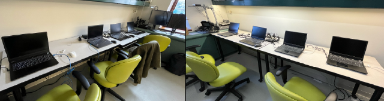

# Computers with Ubuntu 24.04

The assignments for CPSC 4590/5590 require using [Ubuntu 24.04](https://ubuntu.com/blog/tag/ubuntu-24-04-lts) and [ROS 2 Jazzy](https://docs.ros.org/en/jazzy/index.html). 

Students enrolled in the course may use any of the computers below for the assignments, which should have all the assignment dependencies already installed:

- Laptops in AKW 411. The laboratory of the Interactive Machines Group (led by Marynel) provides access to 8 laptops for the assignments, which are located in AKW 411. These laptops should not be moved from their respective locations in the lab. 

    Each laptop is named as `bimX`, where `X` is a digit (e.g., `bim1`). Students should login with their netID in these laptops. Note that the filesystem of these laptops is NOT networked; so if a student logs into `bim1` and sets up their ROS space per [SETUP0..md](SETUP0_ROSWorkspace.md), then when they log into `bim2` for the first time, they will need to re-create their workspace. 

    

- Zoo computers that are not headless. The Computer Science department at Yale provides students access to desktop computers for coursework. The computers that are not headless are located in AKW (3rd floor) or in 17HH ([room 111](https://registrar.yale.edu/yale-university-classrooms/classroom-list/hlh17-111)). See [https://zoo.cs.yale.edu/newzoo/](https://zoo.cs.yale.edu/newzoo/) for more details.

    Similar to the bim laptops, students should log into the Zoo machines with their netID. 

If students choose to use a different computer than those listed above for the assignments, then they would likely need `sudo` permission to install the dependencies for the assignments. See the [SETUP0..md](SETUP0_ROSWorkspace.md) file for more details.

